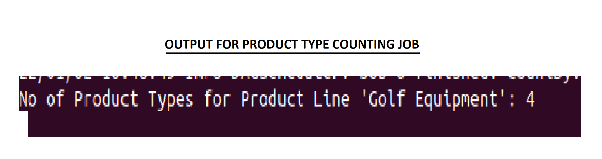
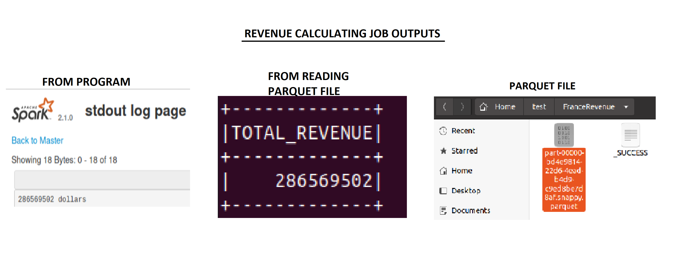
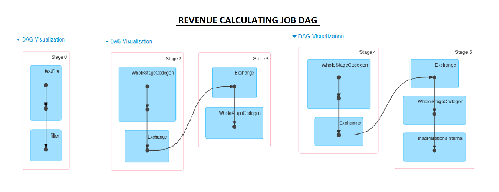

# Team-C-Sales-Data-Processor

## Team Members
 - Giridhara Prasath G
 - Jennifer R
 - Keerthivasan M
 - Mohamed Rella M R
 - Pavithra M
 - Sai Rakesh K V

## Output and DAG
The processing of the sales data has been divided into 2 jobs
 - Product type counting job
 - Revenue calculating job

The output screenshots and DAGs (Directed Acyclic Graphs) of the 2 jobs are given below

